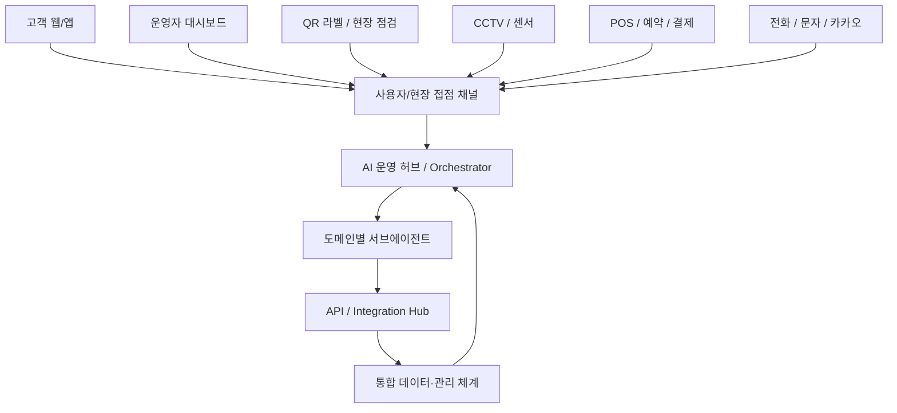
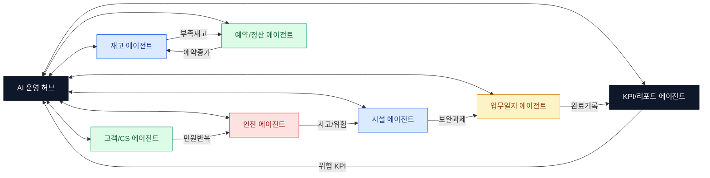

# 대형 운영조직형 자동 서브에이전트 상세 설계

최종 정리: 2026-05-10

## 1. 전체 구조

이 설계는 대형 테마파크, 아쿠아리움, 박물관, 복합문화시설에서 쓰는 운영 자동화 구조를 기준으로 합니다. 핵심은 모든 현장 접점과 API 데이터를 중앙 오케스트레이터가 받아서, 도메인별 서브에이전트가 판단하고, 필요한 조치를 앱 안에서 바로 실행하게 만드는 것입니다.

## 2. 중앙 오케스트레이터

중앙 오케스트레이터는 모든 서브에이전트를 지휘하는 운영 허브입니다.

### 주요 역할

- 데이터 라우팅: 시설, 재고, 안전, 고객, 예약, 매출 데이터를 적절한 에이전트로 전달
- 권한 체크: 관리자, 담당자, 조회자 권한에 맞춰 실행 가능 범위 제한
- 워크플로우 실행: 이동, 과제 등록, 알림, 리포트 생성
- 로그 기록: 추천, 실행, 완료, 실패 이력을 활동 기록에 저장
- KPI 집계: 위험 수, 미완료 수, 재고 부족 수, 업무일지 누락 수 집계

### 현재 앱 적용

- 상단 `서브에이전트` 버튼이 오케스트레이터 진입점입니다.
- `자동 감시` 토글은 오케스트레이터의 상시 관찰 모드입니다.
- 추천 조치 배지는 오케스트레이터가 집계한 실행 대기 건수입니다.

## 3. 도메인별 서브에이전트 상세

## A. 고객·마케팅 에이전트

현재 앱에는 직접 고객 CRM 모듈은 없지만, 향후 예약, 민원, 캠페인, 리뷰 데이터가 붙을 때 확장할 수 있습니다.

### 세부 에이전트

- 고객상담 에이전트: 문의, 민원, 분실물, 불편사항 분류
- 리뷰/입소문 에이전트: 리뷰 키워드, 만족도, 반복 불만 감지
- CRM 세그먼트 에이전트: 단체, 가족, 학교, 재방문 고객 분류
- 캠페인 자동발송 에이전트: 문자, 카카오, 이메일 안내 발송
- SNS/콘텐츠 기획 에이전트: 행사, 교육, 전시 홍보 콘텐츠 추천

### 연결 데이터

- 예약 DB
- 문의/민원 기록
- 고객 DB
- 카카오/문자 API
- 홈페이지 CMS

## B. 영업·예약·정산 에이전트

예약, 티켓, 결제, 정산을 묶는 수익 운영 에이전트입니다.

### 세부 에이전트

- 온라인예약 에이전트: 예약 현황, 잔여 좌석, 노쇼 위험 확인
- 단체예약 에이전트: 학교/기관 예약, 인솔자 연락, 일정 충돌 확인
- 티켓검증 에이전트: QR/바코드 입장권 검증
- 결제/환불 에이전트: 결제 상태, 환불 요청, 미정산 건 확인
- 매출정산 에이전트: 일매출, 객단가, 정산 누락 확인
- 업셀링 제안 에이전트: 체험, 교육, MD 상품 추천

### 실행 예시

- 단체 예약 인원 증가 → 재고 에이전트에 식음/교구 준비 신호 전송
- 결제 오류 증가 → 고객상담 에이전트와 정산 에이전트 동시 알림

## C. 현장운영·CS 에이전트

현장 혼잡, 대기시간, 직무 배치, 민원 처리를 담당합니다.

### 세부 에이전트

- 운영일정 에이전트: 개장/폐장, 교육, 행사, 점검 일정 통합
- 혼잡도 분산 에이전트: 구역별 방문객 밀집도 감지
- 대기시간 안내 에이전트: 체험/교육/입장 대기시간 안내
- 시설오픈/마감 체크 에이전트: 개장 전/마감 후 점검 상태 확인
- 직원업무 배정 에이전트: 근무자, 담당 구역, 미완료 업무 매칭
- 분실물/민원처리 에이전트: 접수, 담당자 배정, 완료 추적

### 현재 앱 적용

- 통합지도
- 시설점검
- 업무일지
- 활동 기록

## D. 안전·시설·보안 에이전트

현재 앱의 핵심 운영축입니다. 시설 이상, 보완과제, CCTV, 사고 기록을 묶어 위험을 줄입니다.

### 세부 에이전트

- CCTV 이벤트 감지 에이전트: 이상 움직임, 출입, 위험 상황 감지
- 안전사고 대응 에이전트: 사고 기록, 후속 조치, 재발 방지 과제 생성
- 점검 스케줄 에이전트: 정기 점검 누락, 기한 초과 감지
- 설비이상 감지 에이전트: 고장, 누수, 파손, 온습도 이상 감지
- 출입통제/보안 에이전트: 제한구역 접근, 야간 출입 확인
- 비상알림 에이전트: 긴급 알림, 관리자 호출, 보고서 초안 생성

### 현재 앱 적용

- 미완료/긴급/기한초과 보완과제 분석
- 사고 후속 점검 과제 등록
- 안전관리 화면 이동
- 활동 기록 저장

## E. 콘텐츠·공연·교육 에이전트

교육 프로그램, 전시, 체험, 콘텐츠 운영을 관리합니다.

### 세부 에이전트

- 행사기획 에이전트: 행사 일정, 준비물, 담당자 체크
- 체험교육 운영 에이전트: 교육 재료, 인원, 시간표, 강사 배정
- 공연/퍼레이드 스케줄 에이전트: 시간, 장소, 혼잡도, 안내문 관리
- 상품·MD 기획 에이전트: 인기 상품, 부족 재고, 시즌 상품 추천
- 스토리/IP 확장 에이전트: 전시 해설, 교육 스크립트, 홍보 문안 생성
- 학습콘텐츠 제작 에이전트: 어린이/단체 교육자료 자동 초안 생성

### 연결 데이터

- 예약
- 재고
- 업무일지
- SNS/홈페이지 CMS

## F. 생물·수질·특수운영 에이전트

아쿠아리움, 동물원, 생태시설처럼 생물과 수질, 전문 장비가 필요한 시설에 대응합니다.

### 세부 에이전트

- 사육일지 에이전트: 급이, 행동, 이상 상태 기록
- 급이 스케줄 에이전트: 생물별 급이 시간, 식단, 재고 연결
- 수질 모니터링 에이전트: 수온, pH, 염도, 탁도, 산소량 감지
- 건강/검역 기록 에이전트: 치료, 검역, 수의 기록 관리
- 전시해설 운영 에이전트: 생물 설명, 관람객 안내, 교육 문구 생성
- 보전/연구 데이터 에이전트: 장기 관찰, 번식, 연구 기록 저장

### 현재 앱 확장 방향

- 안전관리의 일일 점검과 연결
- 재고관리의 급이/약품 품목과 연결
- 업무일지의 전문 점검 항목으로 자동 반영

## 4. API / Integration Hub

API 허브는 외부 시스템과 내부 데이터를 연결하는 접속층입니다.

### 내부 시스템 API

- 홈페이지 CMS API
- 예약 시스템 API
- 티켓/게이트 API
- POS/매출 API
- 회원/CRM API
- 그룹웨어/근태 API
- 재고/창고 API
- CCTV/VMS API
- IoT/센서 MQTT

### 외부 플랫폼 API

- 네이버 지도/플레이스 API
- 카카오 알림톡 API
- SMS 발송 API
- 이메일 API
- 결제 PG API
- 구글 애널리틱스/태그
- 메타 전환 API
- 지도/위치 API

### AI/업무 자동화 API

- OpenAI API
- Claude API
- STT/TTS API
- OCR/문서해석 API
- 번역 API
- 검색/벡터 DB API
- 워크플로우 자동화 Webhook
- BI/리포트 API

## 5. 통합 데이터·관리 체계

모든 서브에이전트는 같은 데이터 체계를 바라봐야 합니다.

### 통합 데이터 저장소

- 고객 DB
- 예약 DB
- 매출 DB
- 운영 로그
- CCTV/센서 로그
- 콘텐츠 자산
- 시설/재고/안전 데이터

### 권한·보안

- 대표
- 관리자
- 팀장
- 현장직원
- 외부업체
- 감사로그

### 자동 알림·보고

- 카카오/문자 알림
- 일일 운영 리포트
- 주간 매출 리포트
- 사고 즉시 보고
- 민원 SLA 알림
- 점검 예정 알림

### 핵심 KPI

- 방문객 수
- 대기시간
- 예약 전환율
- 사고 건수
- 매출/객단가
- 체험 만족도
- 재방문율
- 리뷰 평점

## 6. 옵션: 뉴럴링크형 운영망

뉴럴링크형 운영망은 각 서브에이전트를 따로 움직이는 기능이 아니라, 서로 신호를 주고받는 운영 신경망으로 설계하는 방식입니다.

### 뉴럴링크 규칙

1. 한 에이전트의 위험 신호는 관련 에이전트에 자동 전달합니다.
2. 모든 신호는 오케스트레이터를 거쳐 권한과 중복 여부를 확인합니다.
3. 실행 가능한 추천만 사용자에게 보여줍니다.
4. 사용자가 승인한 실행만 실제 과제, 알림, 보고로 전환합니다.
5. 실행 결과는 업무일지와 KPI에 다시 반영됩니다.

### 예시 시나리오

#### 시나리오 1: 안전 사고 발생

1. 안전 에이전트가 사고 기록을 감지합니다.
2. 시설 에이전트가 사고 장소의 보완과제를 생성합니다.
3. 업무일지 에이전트가 후속 기록 필요를 표시합니다.
4. KPI 에이전트가 사고 건수를 갱신합니다.
5. 오케스트레이터가 관리자에게 긴급 추천 조치를 띄웁니다.

#### 시나리오 2: 단체 예약 증가

1. 예약 에이전트가 단체 예약 증가를 감지합니다.
2. 재고 에이전트가 교구, 식음, 소모품 부족 여부를 확인합니다.
3. 현장운영 에이전트가 혼잡 예상 구역을 표시합니다.
4. 콘텐츠 에이전트가 교육 자료와 안내 문구를 준비합니다.
5. KPI 에이전트가 예상 방문객과 매출을 갱신합니다.

#### 시나리오 3: 재고 부족

1. 재고 에이전트가 최소수량 이하 품목을 감지합니다.
2. 시설 또는 교육 에이전트가 해당 품목이 필요한 업무를 확인합니다.
3. 예약/정산 에이전트가 발주 또는 품의 흐름을 연결합니다.
4. 업무일지 에이전트가 조치 내역 기록을 요청합니다.

## 7. 구현 로드맵

### 1단계: 데이터 연결

- 현재 localStorage 기반 데이터 통합 유지
- 시설, 재고, 안전, 업무일지 데이터를 오케스트레이터로 수집
- 추천 조치와 활동 기록 연결

### 2단계: FAQ·예약 자동화

- 고객/예약/문의 데이터 연결
- 카카오/문자 알림 연동
- 단체 예약 흐름 자동화

### 3단계: 운영·안전 자동화

- CCTV/센서/API 연결
- 사고 즉시 보고
- 시설 보완과제 자동 추천 강화

### 4단계: KPI 대시보드·예측분석

- KPI 전용 에이전트 추가
- 위험 예측, 방문객 예측, 재고 소진 예측
- 대표 리포트 자동 생성
